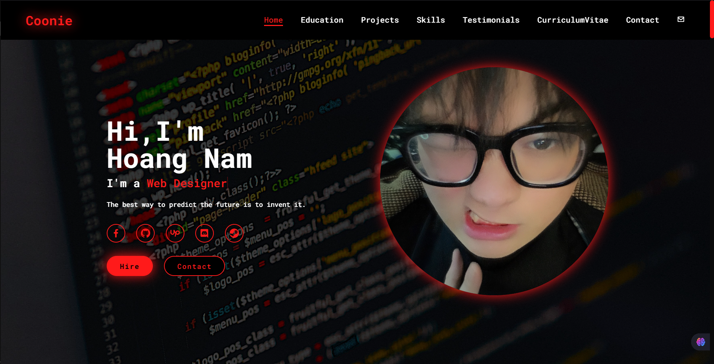

# 🌟 Personal Portfolio Website - Hoang Nam



## 🌐 Demo Live

🔗 **[Xem Demo Website](https://hoangnam-introduce.vercel.app/)**

## 📝 Giới thiệu

Website Portfolio cá nhân của **Hoang Nam** - một ứng dụng web hiện đại và đơn giản được thiết kế để giới thiệu thông tin cá nhân, kỹ năng, kinh nghiệm làm việc và các dự án đã hoàn thành. Website nhằm mục đích làm nổi bật khả năng chuyên môn và phong cách làm việc, tạo ấn tượng mạnh mẽ với các nhà tuyển dụng và khách hàng tiềm năng.

## ✨ Tính năng chính

- **🏠 Trang chủ:** Giới thiệu bản thân với hiệu ứng typing animation
- **🎓 Học vấn:** Timeline hiển thị quá trình học tập
- **💼 Dự án:** Showcase các dự án đã thực hiện với slider
- **🛠️ Kỹ năng:** Biểu đồ hiển thị các kỹ năng công nghệ
- **💬 Testimonials:** Đánh giá từ khách hàng/đồng nghiệp
- **📄 CV:** Xem trước và tải xuống CV
- **📧 Liên hệ:** Form liên hệ và thông tin social media
- **📱 Responsive:** Tương thích với mọi thiết bị

## 🎨 Demo

Website có giao diện hiện đại với:

- **Màn hình chủ:** Avatar cá nhân và thông tin giới thiệu
- **Hiệu ứng:** Smooth scrolling, typing animation
- **Theme:** Dark/Light mode support
- **Social Links:** Facebook, GitHub, Upwork, Discord, Steam

## 🚀 Công nghệ sử dụng

- **Frontend:**
  - HTML5
  - CSS3 (Flexbox, Grid, Animations)
  - JavaScript (ES6+)
  - BoxIcons
  - Google Fonts

- **Tính năng:**
  - Responsive Design
  - Cross-browser Compatibility
  - SEO Optimized
  - Fast Loading

## 📁 Cấu trúc dự án

```text
web-IntroduceSecondName/
├── index.html              # Trang chính
├── contact.js              # Xử lý form liên hệ
├── function.js             # Các function chính
├── css/                    # Stylesheets
│   ├── style.css
│   ├── project-slide.css
│   ├── custom-input.css
│   └── contact-list.css
├── js/                     # JavaScript files
│   ├── firebase1.js
│   ├── function.js
│   └── project-slide.js
├── image/                  # Hình ảnh
│   ├── avatar.jpeg
│   ├── avatar2.jpeg
│   ├── background.jpg
│   └── project-image/
├── icon/                   # Icons
└── ImagesReadme/          # Ảnh cho README
    └── Introduce1.png
```

## 🛠️ Cài đặt và chạy

1. **Clone repository:**

   ```bash
   git clone https://github.com/luuconghoangnam/web-IntroduceSecondName.git
   ```

2. **Mở thư mục dự án:**

   ```bash
   cd web-IntroduceSecondName
   ```

3. **Chạy website:**
   - Mở file `index.html` trực tiếp trong trình duyệt
   - Hoặc sử dụng Live Server extension trong VS Code
   - Hoặc chạy local server:

     ```bash
     # Python
     python -m http.server 8000
     
     # Node.js
     npx http-server
     ```

4. **Truy cập:** `http://localhost:8000`

## 📧 Liên hệ

- **Facebook:** [gaumeoanbanhxeo](https://www.facebook.com/gaumeoanbanhxeo/)
- **GitHub:** [luuconghoangnam](https://github.com/luuconghoangnam)
- **Upwork:** [Hoang Nam Profile](https://www.upwork.com/freelancers/~01fd053ba8194cd707?mp_source=share)
- **Discord:** Available on request
- **Steam:** [Steam Profile](https://steamcommunity.com/profiles/76561199209523517/)

## 🎯 Mục tiêu

Website này được tạo ra nhằm:

- Giới thiệu bản thân một cách chuyên nghiệp
- Showcase các kỹ năng và dự án đã thực hiện
- Tạo ấn tượng tốt với nhà tuyển dụng
- Cung cấp thông tin liên hệ đầy đủ

## 📝 License

Dự án này được phát triển cho mục đích cá nhân và học tập.

---

⭐ **"The best way to predict the future is to invent it."** ⭐

### Made with ❤️ by Hoang Nam
